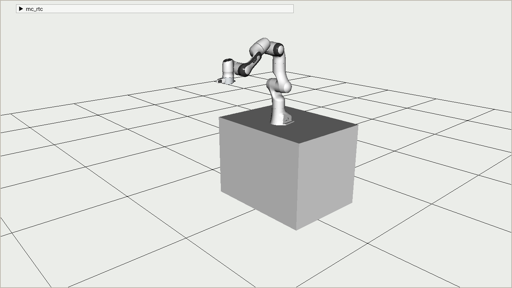
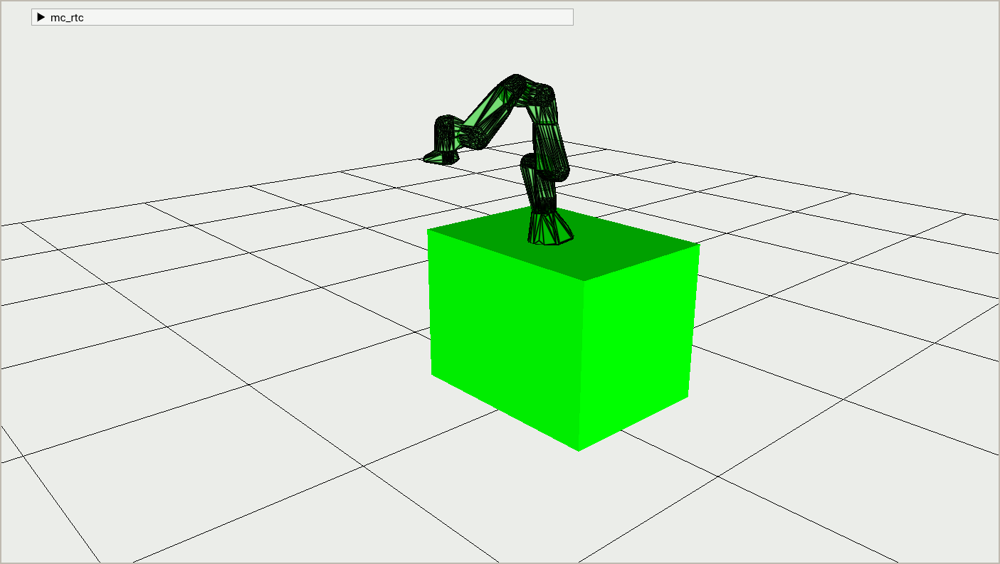
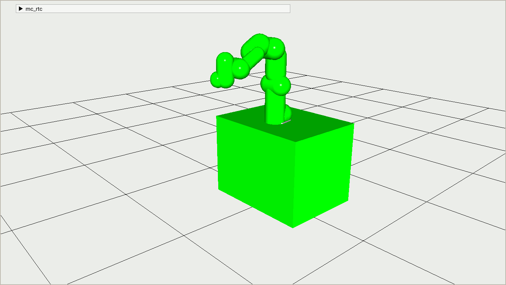
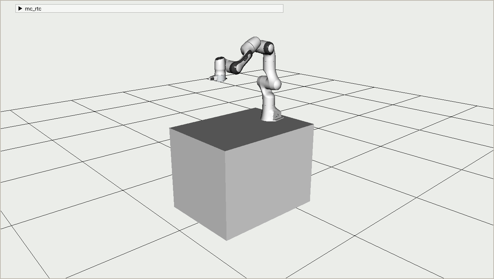
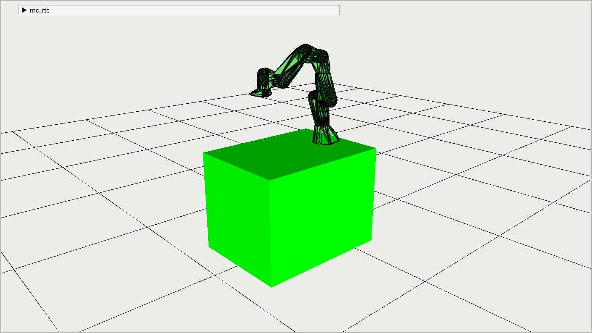
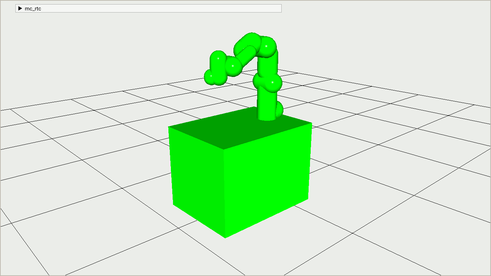

# mc_panda_lirmm

[](https://opensource.org/licenses/BSD-2-Clause)
[](https://github.com/jrl-umi3218/mc_panda_lirmm/actions?query=workflow%3A%22CI+of+mc_panda_lirmm%22)

This package extends the [mc_panda] robot modules and provides modules specific to the panda robots in `LIRMM`. Notably these include the supports on which the robots are attached.

## Module Naming and Variants

This package provides robot modules for the robots `Panda2`, `Panda6`, and `Panda7` at LIRMM, with support for different end effectors, supports (tables/metal supports), and calibration status.

**Module names follow this convention:**
```
<PandaLIRMMVariant>_<PandaRobot>_<Tool>_<SupportName>[_Calibrated]
```
- `PandaLIRMMVariant`: Panda2LIRMM, Panda6LIRMM, Panda7LIRMM
- `PandaRobot`: FR1, FR3
- `Tool`: Default, Pump, Foot, Hand, Mukca, PandaToPandaCalib
- `SupportName`: Table1, Table2, MetalSupport, or empty if no support
- `_Calibrated`: Suffix if using a calibrated model

**Examples:**
- `Panda2LIRMM_FR3_Default_Table1`
- `Panda7LIRMM_FR1_Pump_Table2_Calibrated`
- `Panda6LIRMM_FR1_Hand_MetalSupport`
- `Panda2LIRMM_FR3_Mukca`

## Migration Guide

### Previous Usage

Previously, modules were named like:
- `Panda7LIRMMDefault`
- `Panda2LIRMMHand`
- etc.

### New Usage

Now, you must use the new naming scheme, which is more explicit and supports additional features:

**Old:**
```
Panda7LIRMMDefault
```
**New:**
```
Panda7LIRMM_FR3_Default
```
or, with support and calibration:
```
Panda7LIRMM_FR1_Hand_Table2_Calibrated
```

## Dependencies

This package requires:
- [mc_panda]


## Nix support

This project provides a `flake.nix` for reproducible builds and development environments using [Nix](https://nixos.org/). To enter a development shell with all dependencies available, run:

Make sure you have [Nix](https://nixos.org/download.html) installed with flakes enabled.

### Building/developing

```sh
nix develop
```

This allows to build the project itself

```sh
mkdir build
cd build
cmake -GNinja ..
ninja
```

To build the project using Nix flakes:

```sh
nix build
```

## LIRMM Robots Information

### Panda2

IP: 192.168.1.2

Panda2 model


Panda2 convex


Panda2 basic convex shapes


### Panda6

IP: 172.16.0.6

panda6 model


panda6 convex


panda6 basic convex shapes


### Panda7

IP: 172.16.1.7

Panda7 model


Panda7 convex


Panda7 basic convex shapes

