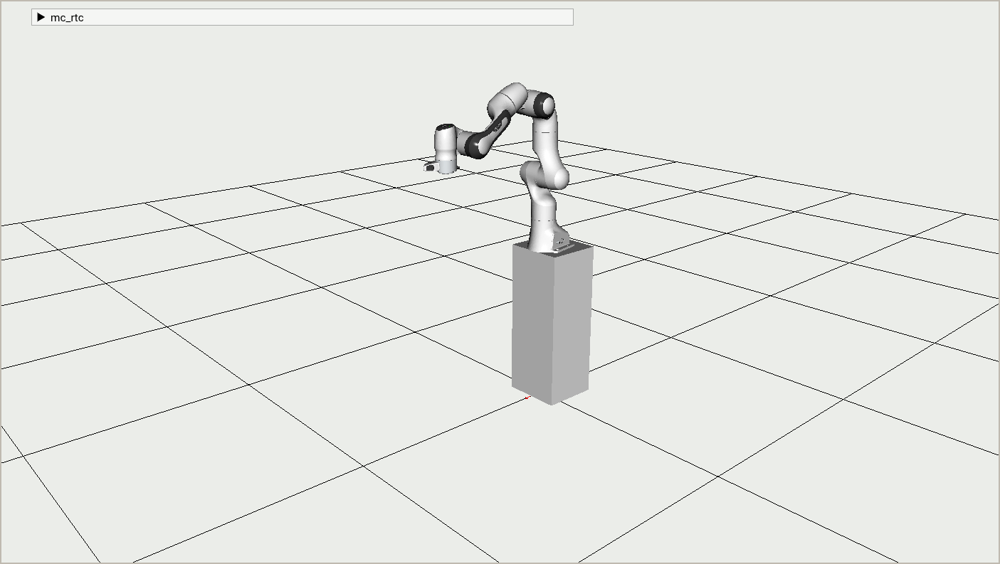
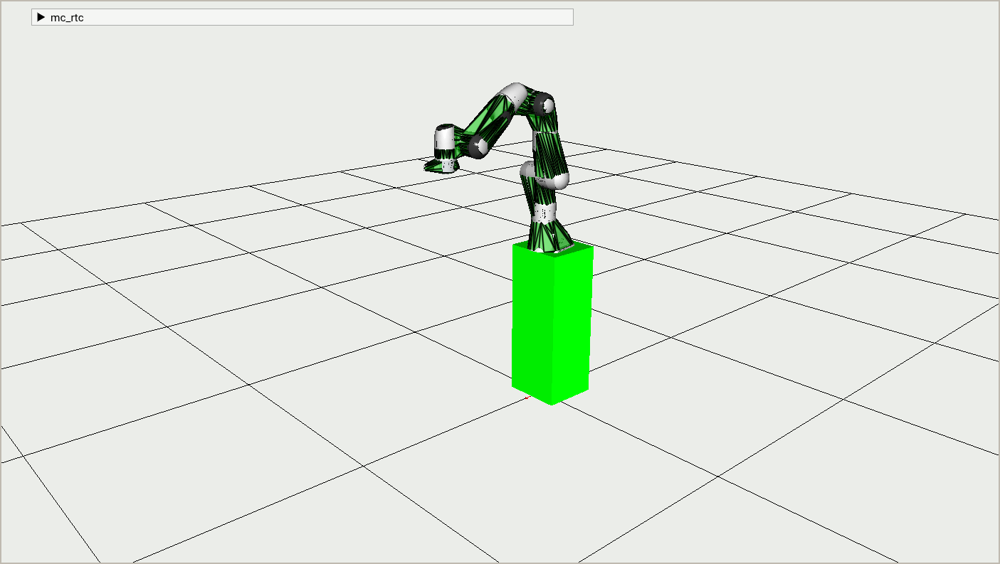
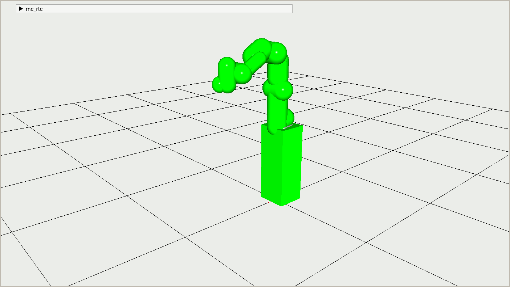

mc_panda_lirmm
========

This package extends the [mc_panda] robot modules and provides modules specific to the panda robots in `LIRMM`. Notably these include the supports on which the robots are attached.

Naming convention
===

`mc_panda` provides the following modules:
- `PandaDefault`
- `PandaHand`
- `PandaFoot`
- `PandaPump`

In addition this package provides modules for the robots `Panda2`, `Panda5` and `Panda7` (each corresponding to one of the panda robots at `LIRMM`). Robot modules are named `<RobotName>LIRMM<End Effector>`.
Since the robots' estimated force sensor is left handed, and most simulators do not support this, for each robot module two variants are further provided:
- `<RobotName>LIRMM<End Effector>` : flips the sensor measurement along one axis such that it becomes right handed. This is intended to be used on the real robot.
- `<RobotName>LIRMM<End Effector>Simulation` : keeps the force sensor measurement as-is. This is intended to be used in simulators where the force sensor measurement is already right-handed.

For example you can use `Panda7LIRMMDefault`, `Panda7LIRMMHand`, `Panda7LIRMMFoot`, `Panda7LIRMMPump`, and their corresponding simulation variants `Panda7LIRMMDefaultSimulation`, `...`

Panda2
===
Panda2 model

Panda2 convex

Panda2 basic convex shapes

Panda5
===

Panda5 model

Panda5 convex

Panda5 basic convex shapes

Panda7
===

Panda7 model

Panda7 convex

Panda7 basic convex shapes

Dependencies
------------

This package requires:
- [mc_panda]
